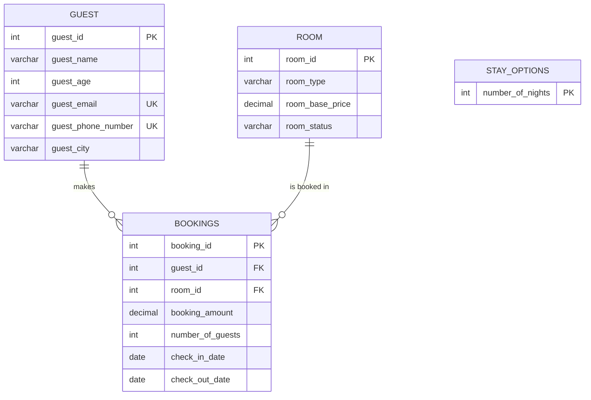

# UK Hotel Management — Database Diagram

Text-based and Mermaid entity-relationship diagrams for the four-table
schema created in `01_schema_creation.sql`, matching Section 2.12 of the
handbook.

```
guest (guest_id PK)
    |
    | 1 : N   (guest.guest_id = bookings.guest_id)
    v
bookings (booking_id PK, guest_id FK -> guest, room_id FK -> room)
    ^
    | N : 1
    |
room (room_id PK)

stay_options (number_of_nights PK)   -- standalone lookup table, no FKs
```

## Mermaid ER diagram



## Relationship summary table

| Parent table | Child table | Join column | Cardinality | ON UPDATE / ON DELETE  | Business meaning                                   |
|--------------|-------------|-------------|-------------|------------------------|-----------------------------------------------------|
| guest        | bookings    | guest_id    | 1 : N       | CASCADE / RESTRICT     | One guest may have several bookings, or none.        |
| room         | bookings    | room_id     | 1 : N       | CASCADE / RESTRICT     | One room may have several bookings, or none.         |

`stay_options` has no foreign-key relationship to any other table -- it is
a standalone reference table (1 to 5 nights) used only to build the
CROSS JOIN pricing grid in `05_join_queries.sql`.

## Table creation order (respects the one foreign-key dependency)

1. `guest`
2. `room`
3. `bookings` (depends on both `guest` and `room`)
4. `stay_options` (independent)

## Notes on the design

- `guest_id` and `booking_id` are `AUTO_INCREMENT`; `room_id` is a plain
  `INT PRIMARY KEY` supplied explicitly, matching the handbook's own
  schema exactly (physical room numbers are assigned by the hotel, not
  generated by the database).
- Both foreign keys in `bookings` use `ON UPDATE CASCADE ON DELETE
  RESTRICT`: a guest or room can be renumbered and every dependent
  booking follows automatically, but neither can be deleted while
  bookings still reference it. Both behaviours are proven live in
  `04_referential_integrity_demos.sql`.
- `guest_email` and `guest_phone_number` are each independently `UNIQUE`
  (not a composite unique key), and `guest_phone_number` is nullable --
  two guests in the dataset (Isla Brown, Mia Roberts) share the value
  `NULL`, which MySQL permits because `NULL` is never considered equal
  to another `NULL` under a `UNIQUE` constraint.
